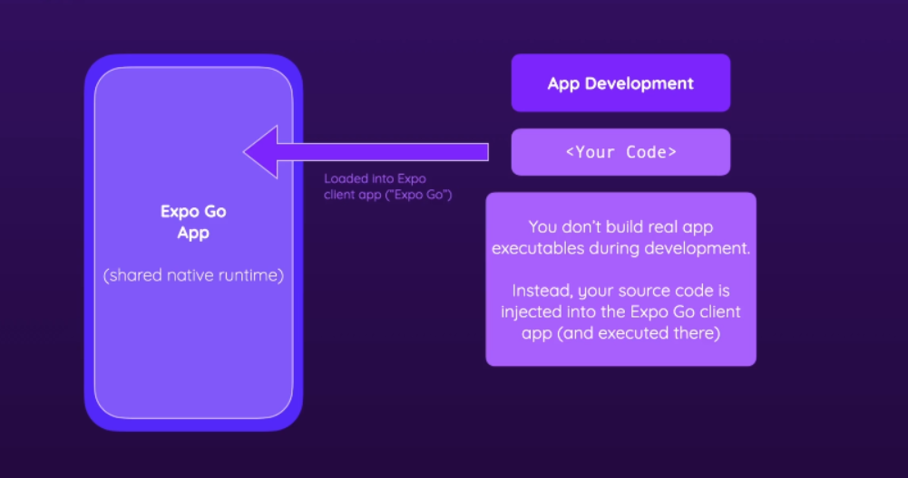
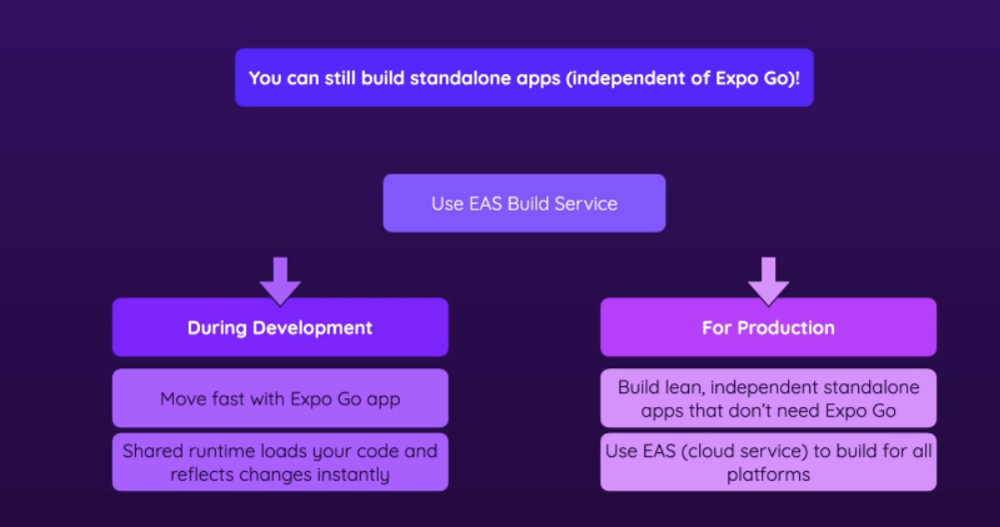
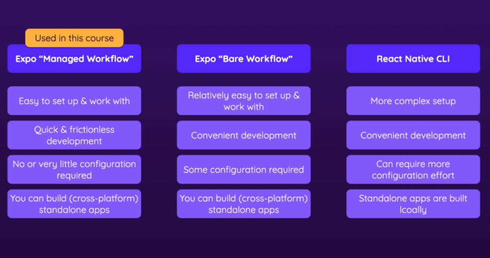

# React Native

<a href='https://reactnative.dev/'>Officical website</a>

---

- [What is React Native?](#1)
- [Two ways of styling](#2)
- [Debugging](#3)
- [Core Components](#4)
- [Navigation between screens](#5)
- [Redux & Context API](#6)
- [Handle input, Validations](#7)
- [HTTP Requests, Fetch, Error Handling](#8)
- [Authentication](#9)
- [Camera, Location, Local storage ](#10)
- [Vanilla React Native ](#11)

### 📒 What is React Native? <a name="1"></a>


There are two ways to creat app.


---

### 📒 Two ways of styling <a name="2"></a>

Styling language is inspired by CSS and close to CSS, but it's not exactly the same.


```javascript
<View style={{ flexDirection: "row", height: 100, padding: 20 }}>
  <Text>Hello World!</Text>
</View>
```

Inline style (style prop) is not supported on all elements.

```javascript
<View style={styles.container}>
  <Text>Hello World!</Text>
</View>;

const styles = StyleSheet.create({
  container: {
    flex: 1,
    backgroundColor: "#ddd",
    alignItems: "center",
    justifyContent: "center",
  },
});
```

Style sheet objects allows to clearly separate JSX code and it also makes styles reusable.

---

### 📒 Debugging <a name="3"></a>

React Native provides an in-app developer menu which offers several debugging options. One of the popular is React Developer Tools

```
sudo npm install -g react-devtools
react-devtools
```


---

### 📒 Core Components <a name="4"></a>

🚩 [Udemy-RN-1](https://github.com/agpavlik/Udemy-RN-01). This example containes next components:

- <a href='https://reactnative.dev/docs/next/view'>View</a> - container (equivalent `<div>`)

- <a href='https://reactnative.dev/docs/next/text'>Text</a> - component for displaying text

- <a href='https://reactnative.dev/docs/next/textinput'>TextInput</a> - foundational component for inputting text into the app via a keyboard

- <a href='https://reactnative.dev/docs/next/image'>Image</a> - component for displaying different types of images

- <a href='https://reactnative.dev/docs/next/stylesheet'>StyleSheet</a> - abstraction similar to CSS StyleSheets

- <a href='https://reactnative.dev/docs/next/button'>Button</a> - basic button component that should render nicely on any platform.

- <a href='https://reactnative.dev/docs/next/modal'>Modal</a> - basic way to present content above an enclosing view.

- <a href='https://reactnative.dev/docs/next/pressable'>Pressable</a> - wrapper that can detect various stages of press interactions on any of its defined children.

- <a href='https://docs.expo.dev/versions/latest/sdk/status-bar/'>StatusBar</a> from 'expo-status-bar'. A library that provides the same interface as the React Native StatusBar API, but with slightly different defaults to work great in Expo environments.

🚩 [Guess-Number-Game](https://github.com/agpavlik/Guess-Number-Game). In This example containes next components:

- Aforementioned Text, View, Image, TextInput

- <a href='https://reactnative.dev/docs/next/alert'>Alert</a> - launches an alert dialog with the specified title and message.

- <a href='https://reactnative.dev/docs/next/flatlist'>FlatList</a> - performant interface for rendering basic

- <a href='https://reactnative.dev/docs/next/imagebackground#example'>ImageBackground</a> - has the same props as <Image>, and add whatever children to it you would like to layer on top of it.

- <a href='https://reactnative.dev/docs/next/safeareaview'>SafeAreaView</a> - render content within the safe area boundaries of a device. It is currently only applicable to iOS devices.

- <a href='https://docs.expo.dev/versions/latest/sdk/linear-gradient/'>LinearGradient from "expo-linear-gradient"</a> - provides a native React view that transitions between multiple colors in a linear direction.

- <a href='https://docs.expo.dev/versions/latest/sdk/font/'>useFonts from "expo-font"</a> - library that allows loading fonts at runtime and using them in React Native components.

- <a href='https://docs.expo.dev/versions/latest/sdk/splash-screen/'>SplashScreen from "expo-splash-screen"</a> - library is used to tell the splash screen to remain visible until it has been explicitly told to hide. This is useful to do tasks that will happen behind the scenes such as making API calls, pre-loading fonts, animating the splash screen and so on.

- <a href='https://reactnative.dev/docs/dimensions'>Dimensions</a> - get the application window's width and height using API

- <a href='https://reactnative.dev/docs/usewindowdimensions'>useWindowDimensions</a> - automatically updates all of its values when screen size or font scale changes

- <a href='https://reactnative.dev/docs/keyboardavoidingview'>KeyboardAvoidingView</a> - will automatically adjust its height, position, or bottom padding based on the keyboard height to remain visible while the virtual keyboard is displayed

- <a href='https://reactnative.dev/docs/scrollview'>ScrollView</a> - wraps platform ScrollView while providing integration with touch locking "responder" system

- <a href='https://reactnative.dev/docs/platform'>Platform</a> - returns an object which contains all available common and specific constants related to the platform.

---

### 📒 Navigation between screens <a name="4"></a>

[React Navigation](https://reactnavigation.org/docs/native-stack-navigator).

🚩 [Gourmand](https://github.com/agpavlik/Gourmand). This example allows to practice with `Stack` Navigator and `Native Stack` Navigator.

```
npm install @react-navigation/native @react-navigation/native-stack
```

- <a href='https://reactnative.dev/docs/navigation'>NavigationContainer</a> - wrap the whole app

- <a href='https://reactnavigation.org/docs/getting-started'>createNativeStackNavigator</a> - this native-stack navigator uses the native APIs

🚩 [Navigators](https://github.com/agpavlik/Navigators). This example allows to practice with `Drawer` Navigator and `Tabs` Navigators.

```
npm install @react-navigation/drawer

npx expo install react-native-gesture-handler react-native-reanimated
```

- <a href='https://reactnavigation.org/docs/drawer-navigator/'>DrawerNavigator</a> - renders a navigation drawer on the side of the screen which can be opened and closed via gestures.

```
npm install @react-navigation/bottom-tabs
```

---

### 📒 Redux & Context API <a name="6"></a>

[Redux vs React's Context API](https://academind.com/tutorials/reactjs-redux-vs-context-api).

---

### 📒 Handle input, Validations <a name="7"></a>

🚩 [ExpenSee](https://github.com/agpavlik/ExpenSee). This example allows to practice with handle input.

---

### 📒 HTTP Requests, Fetch, Error Handling<a name="8"></a>

🚩 [ExpenSee](https://github.com/agpavlik/ExpenSee). This example allows to practice with http requests, fetching, error hendling, etc.

---

### 📒 Authentication <a name="9"></a>


🚩 [ExpenSee](https://github.com/agpavlik/Udemy-RN-Auth). This example allows to practice with authentication

[React Native AsyncStorage](https://reactnative.dev/docs/asyncstorage).

---

### 📒 Camera, Location, Local storage <a name="10"></a>

🚩 [fav-loc](https://github.com/agpavlik/fav-loc). This example allows to practice with afforementioned features.

- <a href='https://docs.expo.dev/versions/latest/sdk/camera/'>Camera</a> - renders a preview for the device's front or back camera.

- <a href='https://docs.expo.dev/versions/latest/sdk/imagepicker/'>ImagePicker</a> - a library that provides access to the system's UI for selecting images and videos from the phone's library or taking a photo with the camera.

- <a href='https://docs.expo.dev/versions/latest/sdk/map-view/'>MapView</a> - A library that provides a Map component that uses Google Maps on Android and Apple Maps or Google Maps on iOS.

- <a href='https://docs.expo.dev/versions/latest/sdk/sqlite/'>SQLite</a> - gives your app access to a database that can be queried through a SQLite API. The database is persisted across restarts of your app.

---

### 📒 Vanilla React Native <a name="11"></a>

How does Expo Work?






Create project with Bare Workflow:

```
npx create-expo-app <app-name> --template bare-minimum
```

> Experience of Launching an Android App:

1. Lounch Android-studio and create a device.

2. Tried `npm run android` but encountered an error: <i> ERROR: JAVA_HOME is not set and no 'java' command could be found in your PATH.</i>

Solution - install the Java Runtime Environment: <b>sudo apt-get install default-jre</b>

3. Tried `npm run android` but encountered an error: <i>Android Gradle plugin requires Java 17 to run. You are currently using Java 11</i>

Solution: <b>sudo apt-get install openjdk-17-jdk</b>

Check version: <b>java --version</b>

4. Tried `npm run android` but encountered an error: <i>SDK location not found. Define a valid SDK location with an ANDROID_HOME environment variable or by setting the sdk.dir path in your project's local properties file...</i>

Solution: Go to your react-native project then go to the `Android` directory. Create a file with the following name: `local.properties`. Open the file and paste your Android SDK path like below:

<b>sdk.dir = /home/USERNAME/Android/Sdk</b>

Please note that `Sdk` may appear as `sdk`, and the address may not include `USERNAME`, depending on your settings.

5. Tried `npm run android` but encountered an error: <i>Error: adb: failed to install /home/.../android/app/build/outputs/apk/debug/app-debug.apk: cmd: Can't find service: package</i>

Solution - install the Android Debug Bridge: <b>sudo apt install adb</b>
