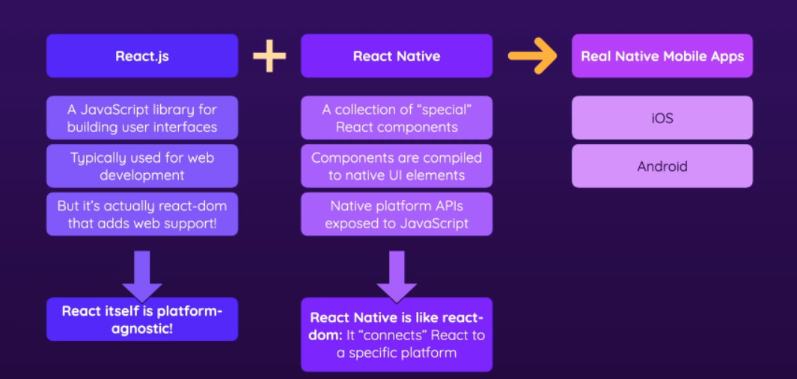
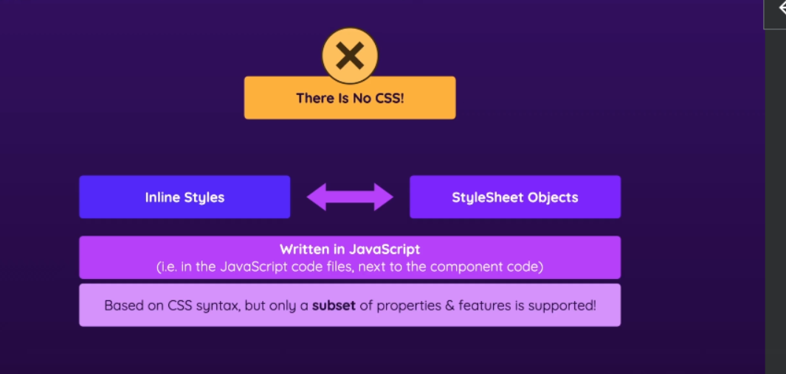
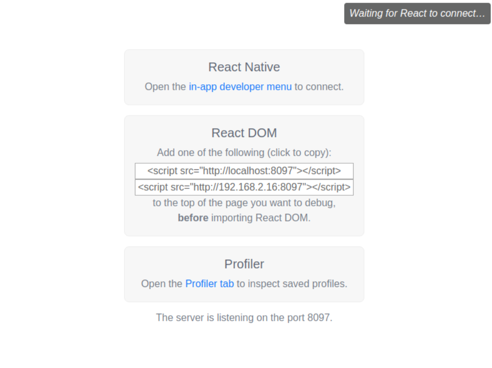

# React Native

<a href='https://reactnative.dev/'>Officical website</a>

---

- [What is React Native?](#1)
- [Two ways of styling](#2)
- [Debugging](#3)
- [Core Components](#4)

---

### 📒 What is React Native? <a name="1"></a>



There are two ways to creat app.


---

### 📒 Two ways of styling <a name="2"></a>

Styling language is inspired by CSS and close to CSS, but it's not exactly the same.



```javascript
<View style={{ flexDirection: "row", height: 100, padding: 20 }}>
  <Text>Hello World!</Text>
</View>
```

Inline style (style prop) is not supported on all elements.

```javascript
<View style={styles.container}>
  <Text>Hello World!</Text>
</View>;

const styles = StyleSheet.create({
  container: {
    flex: 1,
    backgroundColor: "#ddd",
    alignItems: "center",
    justifyContent: "center",
  },
});
```

Style sheet objects allows to clearly separate JSX code and it also makes styles reusable.

### 📒 Debugging <a name="3"></a>

React Native provides an in-app developer menu which offers several debugging options. One of the popular is React Developer Tools

```
sudo npm install -g react-devtools
react-devtools
```



### 📒 Core Components <a name="4"></a>

🚩 [Udemy-RN-1](https://github.com/agpavlik/Udemy-RN-01). This example containes next components:

- <a href='https://reactnative.dev/docs/next/view'>View</a> - container (equivalent `<div>`)

- <a href='https://reactnative.dev/docs/next/text'>Text</a> - component for displaying text

- <a href='https://reactnative.dev/docs/next/textinput'>TextInput</a> - foundational component for inputting text into the app via a keyboard

- <a href='https://reactnative.dev/docs/next/image'>Image</a> - component for displaying different types of images

- <a href='https://reactnative.dev/docs/next/stylesheet'>StyleSheet</a> - abstraction similar to CSS StyleSheets

- <a href='https://reactnative.dev/docs/next/button'>Button</a> - basic button component that should render nicely on any platform.

- <a href='https://reactnative.dev/docs/next/modal'>Modal</a> - basic way to present content above an enclosing view.

- <a href='https://reactnative.dev/docs/next/pressable'>Pressable</a> - wrapper that can detect various stages of press interactions on any of its defined children.

- <a href='https://docs.expo.dev/versions/latest/sdk/status-bar/'>StatusBar</a> from 'expo-status-bar'. A library that provides the same interface as the React Native StatusBar API, but with slightly different defaults to work great in Expo environments.

🚩 [Guess-Number-Game](https://github.com/agpavlik/Guess-Number-Game). In This example containes next components:

- Aforementioned Text, View, Image, TextInput

- <a href='https://reactnative.dev/docs/next/alert'>Alert</a> - launches an alert dialog with the specified title and message.

- <a href='https://reactnative.dev/docs/next/flatlist'>FlatList</a> - performant interface for rendering basic

- <a href='https://reactnative.dev/docs/next/imagebackground#example'>ImageBackground</a> - has the same props as <Image>, and add whatever children to it you would like to layer on top of it.

- <a href='https://reactnative.dev/docs/next/safeareaview'>SafeAreaView</a> - render content within the safe area boundaries of a device. It is currently only applicable to iOS devices.

- <a href='https://docs.expo.dev/versions/latest/sdk/linear-gradient/'>LinearGradient from "expo-linear-gradient"</a> - provides a native React view that transitions between multiple colors in a linear direction.

- <a href='https://docs.expo.dev/versions/latest/sdk/font/'>useFonts from "expo-font"</a> - library that allows loading fonts at runtime and using them in React Native components.

- <a href='https://docs.expo.dev/versions/latest/sdk/splash-screen/'>SplashScreen from "expo-splash-screen"</a> - library is used to tell the splash screen to remain visible until it has been explicitly told to hide. This is useful to do tasks that will happen behind the scenes such as making API calls, pre-loading fonts, animating the splash screen and so on.

- <a href='https://reactnative.dev/docs/dimensions'>Dimensions</a> - get the application window's width and height using API

- <a href='https://reactnative.dev/docs/usewindowdimensions'>useWindowDimensions</a> - automatically updates all of its values when screen size or font scale changes

- <a href='https://reactnative.dev/docs/keyboardavoidingview'>KeyboardAvoidingView</a> - will automatically adjust its height, position, or bottom padding based on the keyboard height to remain visible while the virtual keyboard is displayed

- <a href='https://reactnative.dev/docs/scrollview'>ScrollView</a> - wraps platform ScrollView while providing integration with touch locking "responder" system
